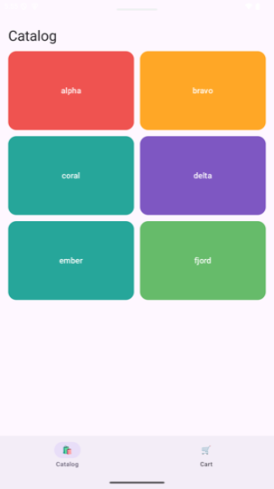
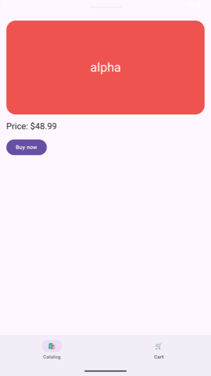
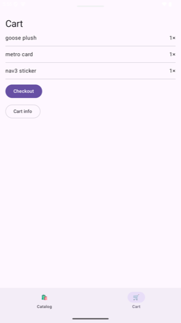

# 🪿 goose

**Modern Compose navigation for apps that grew up on MvRx and fragments — without the rewrite.**

[](LICENSE)

## Why this exists

A lot of very good Android apps are built on Mavericks (MvRx) ViewModels, fragments, and a
FragmentManager back stack. The modern stack — Compose, Navigation 3, compile-time DI — is
better, but every path to it seems to start with "first, rewrite your ViewModels." That's where
migrations go to die: the risky part of an app isn't its views, it's the state machines behind
them, and those are usually the best-tested, most battle-hardened code in the building.

Goose starts from a different premise: **your Mavericks ViewModels are fine. Keep them.**
`setState`, `execute`, `Async`, `@PersistState`, the initial-state-from-args convention — all of
it works unchanged. What Goose replaces is everything *around* the ViewModel:

- **Navigation 3** owns the back stack (a plain list you can see and reason about), instead of a
  FragmentManager or an XML nav graph.
- **[Metro](https://zacsweers.github.io/metro/)** wires features together at compile time:
  each feature *contributes* its screens to the app graph, and the app module just assembles.
- A **Circuit-like API** ties it together: a `Screen` is a small serializable data class, a
  `ScreenUi` renders it, and a `Navigator` interface is the only thing your ViewModels ever see.

That last point is the whole trick. Because ViewModels talk to a `Navigator` interface — not to
a FragmentManager, not to a NavController — the same ViewModel works whether its screen is
hosted by a fragment (today) or a Compose back stack (after migration). **Migration becomes a
per-screen, reversible operation**: keep the VM, write a small composable, delete the fragment.
Do it one screen at a time, ship every week, and never hit a point of no return.

## What it looks like

A screen is a data class in your feature's `:api` module — that's the entire public surface
other features see:

```kotlin
@Serializable data class ProfileScreen(val userId: String) : ScreenWithResult<ProfileResult>
@Serializable data class ProfileResult(val followed: Boolean) : PopResult
```

The ViewModel is your existing Mavericks code with a different front door — assisted state +
navigator in, real dependencies injected:

```kotlin
@AssistedInject
class ProfileViewModel(
    @Assisted initialState: ProfileState,
    @Assisted private val navigator: Navigator,
    private val repo: ProfileRepository,
) : MavericksViewModel<ProfileState>(initialState) {

    fun done() = viewModelScope.launch {
        navigator.pop(ProfileResult(awaitState().followed))   // typed result to whoever asked
    }

    @AssistedFactory fun interface Factory { fun create(s: ProfileState, nav: Navigator): ProfileViewModel }
    companion object : MavericksViewModelFactory<ProfileViewModel, ProfileState>
        by gooseVmFactory(ProfileViewModel::class)
}
```

One class per screen carries everything the feature contributes — UI, presenter wiring, DI:

```kotlin
@ContributesIntoMap(AppScope::class, binding = binding<ScreenEntry>())
@ClassKey(ProfileScreen::class)
@Inject
class ProfileUi(private val vmFactory: ProfileViewModel.Factory) : ScreenUi<ProfileScreen>() {
    @Composable override fun Content(screen: ProfileScreen, modifier: Modifier) {
        val vm = screenViewModel<ProfileViewModel, ProfileState>(screen) { state, navigator ->
            vmFactory.create(state, navigator)
        }
        val state by vm.collectAsState()
        ProfileContent(state, vm::toggleFollow, vm::done, modifier)
    }
}
```

And a whole app root is this:

```kotlin
setContent {
    GooseCompositionLocals(graph) {
        NavigableGooseContent(rememberGooseBackStack(HomeScreen))
    }
}
```

Navigating is constructing a data class: `navigator.goTo(ProfileScreen("ada"))`. Asking a screen
a question is one suspend call: `val answer = navigator.goToForResult(ProfileScreen("ada"))` —
the calling ViewModel suspends until the profile pops with an answer (or `null` if the user
backed out). Results are typed, survive rotation, and can't cross-wire between tabs.

## What you get

| | |
|---|---|
| **Screens** | `@Serializable` data classes in `:api` modules; back stacks survive process death |
| **Presenters** | your Mavericks VMs, entry-scoped: retained on rotation, cleared on pop, `@PersistState` restored |
| **Typed results** | `goToForResult` / `pop(result)`, stack-scoped routing, null on dismissal |
| **Multi-module** | features contribute via Metro; app assembles; impl→impl deps fail the build |
| **Tabs** | one persisted stack per tab, state preserved across switches (`TabbedGooseContent`) |
| **Nested flows** | a wizard hosts its own stack; unhandled back bubbles to the parent navigator |
| **Shared VMs** | `FlowViewModelScope` + `flowViewModel()` — flow-level sharing, like `activityViewModel()` but scoped to a flow |
| **Dialogs** | mark a screen `OverlayScreen`; same stack, same results, rendered in a dialog |
| **Shared elements** | `Modifier.sharedScreenElement(key)`, keys declared in `:api` so features never couple |
| **Fragment interop** | both directions, which is what makes the migration incremental (below) |

## The migration path

Two interop pieces make "50% migrated" a stable, shippable place to live:

- **Compose screens on the legacy stack.** A migrated screen with no fragment binder is hosted
  in a `ScreenFragment` automatically — the fragment world pushes and pops it like any other
  fragment, and the screen can't tell.
- **Legacy fragments on the new stack.** A flow that's *mostly* converted flips to
  `NavigableGooseContent`, and its last unconverted fragments ride along as
  `FragmentScreen.of<AboutFragment>()`.

Results cross the boundary in both directions (a compose ViewModel can await an answer from a
legacy fragment and vice versa), and an activity-scoped Mavericks VM can back a fragment and a
compose screen *simultaneously* — one state machine, two view technologies, which is exactly the
mid-migration reality.

The per-screen recipe:

1. Keep the ViewModel file. Swap its companion to `gooseVmFactory(...)`, its constructor to
   assisted `(state, navigator)`.
2. Write a `ScreenUi<S>` rendering what the fragment rendered.
3. Put the `@Serializable` screen in `:api`; contribute the ui and a
   `screenSerializers { subclass(...) }` registration.
4. Delete the fragment.

## Samples

Three apps in [`samples/`](samples), each verified by instrumented tests on an emulator and the
same suites on Robolectric:

| Sample | What it proves |
|---|---|
| [`m1`](samples/m1) | The happy path: two features, typed result round trip, `@PersistState`, recreation survival |
| [`m2`](samples/m2) | Multi-module tabs, nested checkout wizard with a shared flow VM, cross-module results, shared elements, a dialog screen |
| [`m3`](samples/m3) | A 50%-migrated app: legacy MvRx fragments and migrated compose screens on one stack, results across the boundary both ways |

<p align="center">
  
  
  
</p>

## Modules

```
runtime            Screen, Navigator, results, flow scopes — no DI, no Nav3 UI
runtime-metro      ScreenRegistry, GooseCompositionLocals, GooseContent, graph access
runtime-mavericks  screenViewModel / flowViewModel / gooseVmFactory — the MvRx bridge
runtime-nav3       NavigableGooseContent, TabbedGooseContent, back-stack persistence
runtime-fragment   FragmentNavigator, ScreenFragment, FragmentScreen — the interop layer
```

Toolchain: Kotlin 2.4, AGP 9, Navigation 3 (stable line), Metro 1.4, Mavericks 3. Convention
plugins in [`build-logic/`](build-logic) keep module build files to a few lines.

## Known limitations

- Two *equal* screen values on one stack share a Nav3 entry scope — and therefore a ViewModel
  (Nav3's own contentKey semantics). Give screens a distinguishing field when a destination can
  appear twice concurrently.
- In-flight `goToForResult` awaits survive configuration changes but not process death — the
  same contract as a coroutine-wrapped ActivityResult.
- `FragmentNavigator.backStack` is empty by design (screens can't be reconstructed from a
  restored FragmentManager); result delivery still works after restore.
- Tab hosts should pass `onRootBack = { finish() }` to `TabbedGooseContent` — hidden tabs' entries
  stay in the display list (that's what preserves their ViewModels), so back is intercepted even
  at the primary tab's root.

## Status

Early. The API is small on purpose and the samples are the spec — every behavior claimed above
has a test in one of them. Issues and PRs welcome.

## License

[Apache 2.0](LICENSE)
